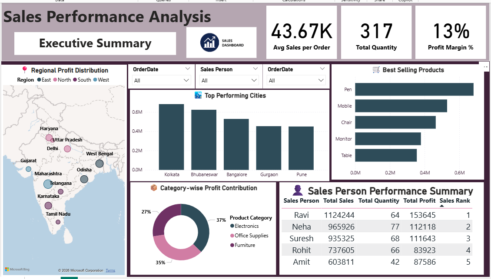
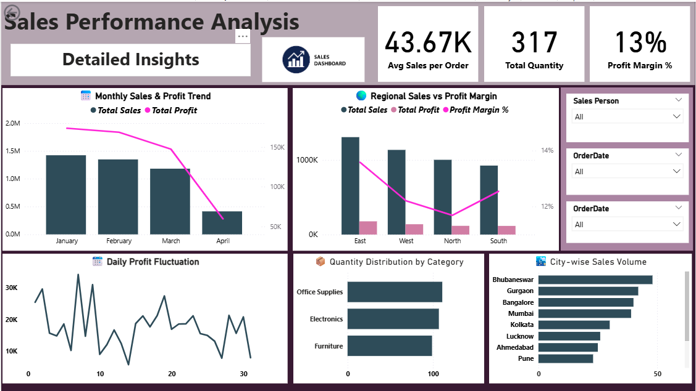

# Sales Performance Analysis – Power BI Dashboard

## 📸 Dashboard Preview




## 🔍 Project Overview

This project is a **Sales Performance Analysis Dashboard** built using **Microsoft Power BI**.
The main goal of this project is to analyze sales data and provide **clear, interactive, and meaningful business insights** for decision-making.

The dashboard is designed in a **professional business style** and focuses on:

- Sales trends
- Profit analysis
- Regional performance
- Product and category contribution
- Sales person performance

---

## 🛠 Tools & Technologies Used

- **Microsoft Power BI** – Data modeling, DAX, and dashboard creation
- **Power Query** – Data cleaning and transformation
- **DAX (Data Analysis Expressions)** – Measures and calculated columns
- **Microsoft Excel / CSV** – Data source
- **GitHub** – Project hosting and version control

---

## 📂 Project Structure

The repository is organized in a simple and easy-to-understand way:

```
sales-profit-analysis-dashboard/
│
├── Sales_Performance_Analysis.pbix   # Main Power BI dashboard file
├── data/
│   └── sales_data.csv                # Raw sales dataset used in the project
├── screenshots/
│   ├── executive_summary.png         # Executive Summary dashboard view
│   └── detailed_insights.png          # Detailed Insights dashboard view
├── README.md                          # Project documentation
```

This structure helps anyone quickly understand the project and explore the dashboard without confusion.

---

## 📁 Dataset Description

The dataset contains sales transaction data with the following key fields:

- **OrderID** – Unique order identifier
- **OrderDate** – Date of order
- **Region** – Sales region (East, West, North, South)
- **State** – State name
- **City** – City name
- **Customer Name** – Customer details
- **Product Category** – Electronics, Office Supplies, Furniture
- **Product** – Product name
- **Sales Amount** – Total sales value
- **Quantity** – Number of items sold
- **Profit** – Profit earned
- **Sales Person** – Sales executive name

---

## 🧮 Data Modeling & Measures

The data model is built using a **single fact table (SalesData)** with calculated measures.

### Key DAX Measures Used:

- **Total Sales**
- **Total Quantity**
- **Total Profit**
- **Average Sales per Order**
- **Profit Margin %**
- **Cumulative Sales**
- **Monthly Sales**
- **Sales Rank (Sales Person Ranking)**

These measures help convert raw data into actionable insights.

---

## 📊 Dashboard Pages & Features

### 🔹 Page 1: Executive Summary

This page provides a **high-level overview** of overall sales performance.

#### Key KPIs:

- **Average Sales per Order**
- **Total Quantity Sold**
- **Profit Margin Percentage**

#### Visuals Included:

- Regional Profit Distribution (Map)
- Top Performing Cities (Bar Chart)
- Best Selling Products (Horizontal Bar Chart)
- Category-wise Profit Contribution (Donut Chart)
- Sales Person Performance Summary (Table with Ranking)

This page helps management quickly understand **where the business stands**.

---

### 🔹 Page 2: Detailed Insights

This page focuses on **deep analysis and trends**.

#### Visuals Included:

- Monthly Sales & Profit Trend (Column + Line Chart)
- Regional Sales vs Profit Margin (Combo Chart)
- Daily Profit Fluctuation (Line Chart)
- Quantity Distribution by Product Category (Bar Chart)
- City-wise Sales Volume (Bar Chart)

This page helps identify:

- Growth and decline patterns
- Region-wise efficiency
- Daily profit volatility
- Product demand behavior

---

## 🎛 Filters & Interactivity

The dashboard includes interactive slicers for:

- **Sales Person**
- **Order Date**

These slicers allow users to dynamically filter the report and analyze data from different perspectives.

---

## 📈 Business Insights Generated

- Identified **top-performing cities and regions**
- Analyzed **best-selling products**
- Measured **profitability by category**
- Ranked **sales persons based on performance**
- Tracked **monthly and daily profit trends**

---

## 🎯 Key Learnings

Through this project, I learned:

- Professional dashboard layout design
- Writing optimized DAX measures
- Using slicers for interactive analysis
- Business-focused data storytelling
- Converting raw data into insights

---

## 🚀 How to Use This Project

1. Download the Power BI (.pbix) file
2. Open it using **Microsoft Power BI Desktop**
3. Explore different dashboard pages
4. Use slicers to filter data
5. Analyze insights visually

---

## 📌 Future Improvements

- Add Year-over-Year (YoY) comparison
- Include forecasting using time series
- Integrate Python visuals for advanced analysis
- Add drill-through pages

---

## 👩‍💻 Author

**Jyoti Gola**\
Aspiring Data Analyst | Power BI | Python | SQL | Excel

🔗 LinkedIn: [https://www.linkedin.com/in/jyoti-gola-67251026a/](https://www.linkedin.com/in/jyoti-gola-67251026a/)\
🔗 GitHub: [https://github.com/Jyoti7890](https://github.com/Jyoti7890)

---

## ⭐ Acknowledgment

This project is created for learning, practice, and portfolio demonstration purposes.

If you like this project, feel free to ⭐ star the repository and share your feedback!

